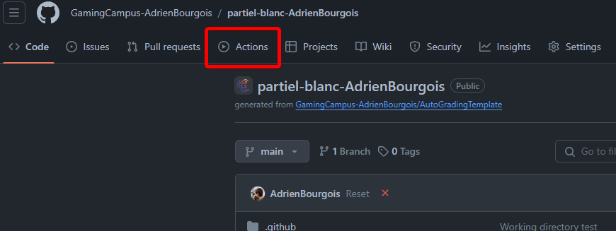
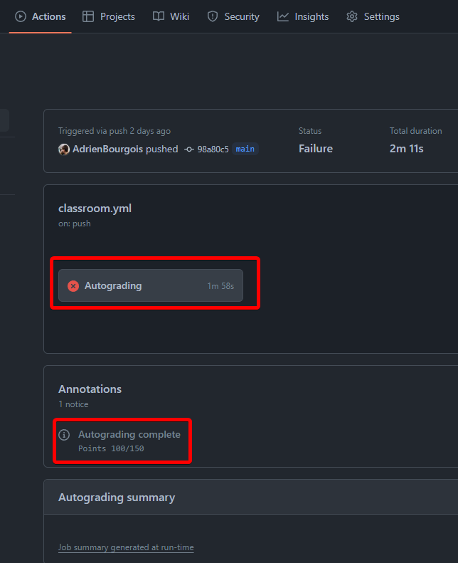
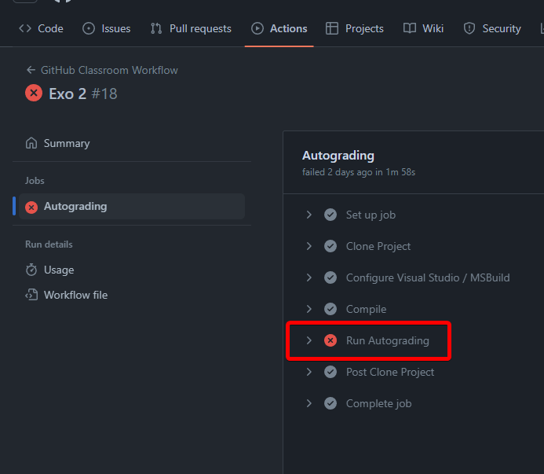
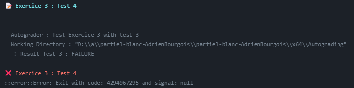

# Partiel C++

Bienvenue au partiel. Ce document contient toutes les instructions nécessaires pour compléter votre test.

## Durée du Test

- **Durée :** 2 heures.

## Structure du Projet

Le projet se compose de deux parties principales :

- **ConsoleApplication :** Contient les instructions des exercices et les tests internes. Vous ne devez pas modifier le code à l'intérieur. Vous y trouverez une classe `ExerciceX` pour chaque exercice, où X est l'identifiant de l'exercice. Vous pouvez consulter ces fichiers pour prendre connaissance des consignes, ainsi que les tests qui seront réalisés.
- **StudentLibrary :** Espace dédié pour votre travail. Vous y trouverez une classe `SolutionX` pour chaque exercice, où X est l'identifiant de l'exercice. Par exemple, votre réponse à `Exercice1` sera dans `Solution1.h/.cpp`. Vous êtes libres de recréer des classes et fonctions pour répondre au problème posé. La structure minimale est fournie pour ne pas avoir de problème de compilation, mais vous restez libre de l'implémentation.

Si vous voulez tester votre code, le fichier `main.cpp` pourra vous aider à executer votre code en local, suivez bien ses instructions !

## Processus de Soumission

- Vous pouvez pousser (push) vos modifications sur GitHub autant de fois que vous le souhaitez pendant le test.
- Pour activer la compilation d'un exercice, il faudra décommenter la macro dans le fichier `CompilationList.h` correspondant à l'exercice, cela permettra de ne pas compiler certains exercices, et donc d'éviter que l'intégralité du projet ne compile pas, empêchant les tests pourtant bons de s'effectuer (pour rappel pas de compilation, pas de programme !) Par exemple pour le premier exercice il faudra décommenter `#define COMPILE_EXERCICE_1` (enlever les `//`)
- Chaque push déclenchera un processus d'autoévaluation via GitHub Actions.

- **Il est possible de consulter les résultats de votre évaluation en accédant à GitHub Actions.**

- **Vous pourrez avoir alors un résultat de test pour chacun de vos commits. Une marque rouge signifie que vous n'avez pas l'intégralité des tests réussis sur l'intégralité de l'examen, donc pas d'inquiétudes**

- **Vous pouvez voir le temps de compilation ainsi que la note actuelle et cliquer sur Autograding pour les logs**

- **Vous pouvez également voir les logs de compilations**

- **Chaque test indiquera ou non sa réussite**

## Instructions Générales

- Lisez attentivement chaque exercice dans **ConsoleApplication**.
- Implémentez vos solutions dans les classes correspondantes dans **StudentLibrary**.
- Assurez vous de tester votre code et d'activer la compilation de l'exercice avant de le push.
- Un `ExerciceExample` est donné pour s'assurer de la compilation et de l'éxecution des tests, il ne fournira bien sûr aucun point.

## Bonne Chance !

Je vous souhaite bonne chance et espère que vous trouverez ce test à la fois stimulant et agréable. N'hésitez pas à push votre code fréquemment pour bénéficier des retours continus de l'autoévaluation.